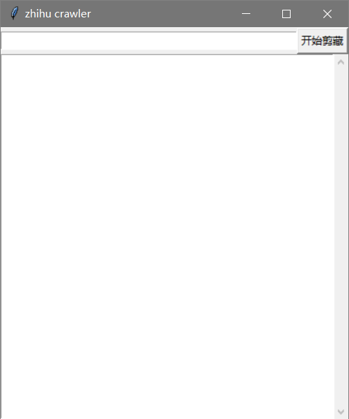

# 项目介绍
该项目用于将知乎的收藏夹（公开或私密）导出为 markdown 格式的文件，供学习和研究使用。
私密收藏夹需要先登录知乎，然后获取 cookies 信息，保存为 cookies.json 文件，并将其放在脚本目录下。

# 安装
首先安装 python。

然后安装依赖。
```bash
pip install -r requirements.txt
```
# 使用
## 终端
首先，请找到您想导出的收藏夹的 url。
然后，在终端（cmd）界面下输入：
```bash
python main.py [收藏夹的url]
```
## 图形界面
从最新的release下载运行文件运行，在输入框 ctrl+v 粘贴收藏夹网址，点击开始剪藏，等待剪藏完毕。


## 文件存放目录
等待下载完成后，文件的存放地址将为：
- markdown 文件将保存在当前操作系统的"**下载**"目录下的"**剪藏**"文件夹下，
- 文章中的图片将保存在剪藏文件夹中的"**assets**"文件夹中

# BUG 反馈
请直接在issue提供BUG，并请附上问题报错的提示或者网址，方便我复现该问题并解决它。

# 建议
- 建议可以在issue中发起
- 通过电子邮件 tangyinhaowork@qq.com 联系我
- 在[obsidian 中文论坛](https://forum-zh.obsidian.md/)中 @致九

# 下一步工作
-[ ] 增加 yaml 区域补充元数据
-[x] 将脚本图形化

# 第三方改动列表

* 2024.02.02
    * 过滤想法类收藏，暂时不做处理
    * 处理专栏及回答中的卡片链接，添加text，使其可以在md正文中正常转换
    * 处理奇怪的```<a>```标签，如：
        * ```ad-link-card```，大多为无用信息，不做处理
        * ```mcn-link-card```，同上，不做处理
        * ```edu-card```，同上，不做处理
        * ```aaa@bbb.ccc```的文本有概率被识别为邮箱，嵌入```<a href='mailto:xxx'></a>```，在转换md的时候会触发error，将其修改为```<p></p>```
    * 在md文本开头插入原始链接
    * 跳过已保存文件